# ExonDomainCompare architecture

This folder provides a visual, implementation-linked description of the
ExonDomainCompare framework. The diagrams cover the scientific workflow, source
code structure, execution environments, evidence and provenance model, analysis
modes, web interface, persistent run state, and reproducible exports.

Each diagram is available in three forms:

- **SVG** for direct viewing in GitHub and scalable use in documents;
- **PDF** for the thesis, printing, and review;
- **D2 source** so that the diagram can be reproduced and updated.

The diagrams describe one generic annotation-aware exon-domain comparison
framework with FGFR2 IIIb/IIIc as its validated event-specific specialization.
The run-local coordinate evidence register is shown as an additive audit layer:
it preserves existing scientific values, model links, QC states, source-row
provenance, and checksums without recomputing biological results.

## Thesis overview figures

### 01 - System architecture and execution model

[Open PDF](pdf/01_overall_system_architecture.pdf) ·
[Open SVG](svg/01_overall_system_architecture.svg) ·
[D2 source](d2/01_overall_system_architecture.d2)


### 04 - Evidence model, provenance, and decision states

[Open PDF](pdf/04_data_flow_diagram.pdf) ·
[Open SVG](svg/04_data_flow_diagram.svg) ·
[D2 source](d2/04_data_flow_diagram.d2)

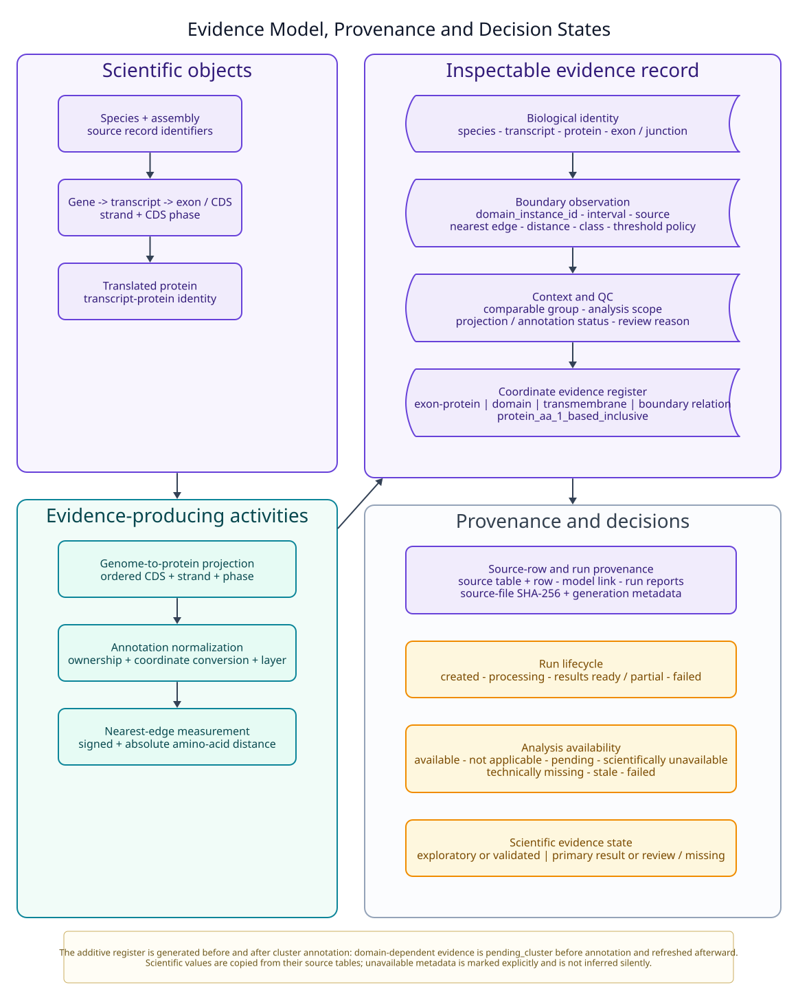

### 06 - Generic exploratory and FGFR2-validated modes

[Open PDF](pdf/06_generic_vs_fgfr2.pdf) ·
[Open SVG](svg/06_generic_vs_fgfr2.svg) ·
[D2 source](d2/06_generic_vs_fgfr2.d2)

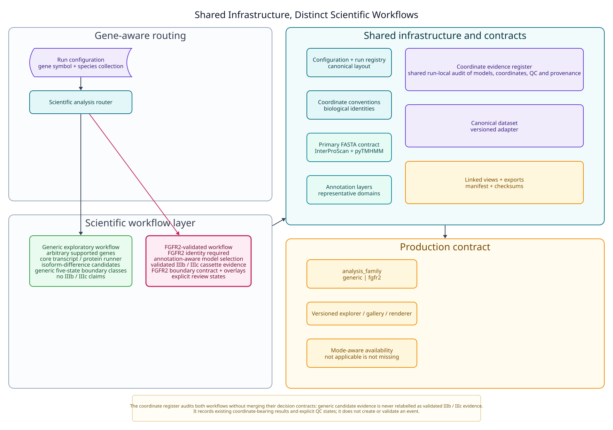

### 07 - Web interface and reproducible outputs

[Open PDF](pdf/07_scientific_user_workflow.pdf) ·
[Open SVG](svg/07_scientific_user_workflow.svg) ·
[D2 source](d2/07_scientific_user_workflow.d2)

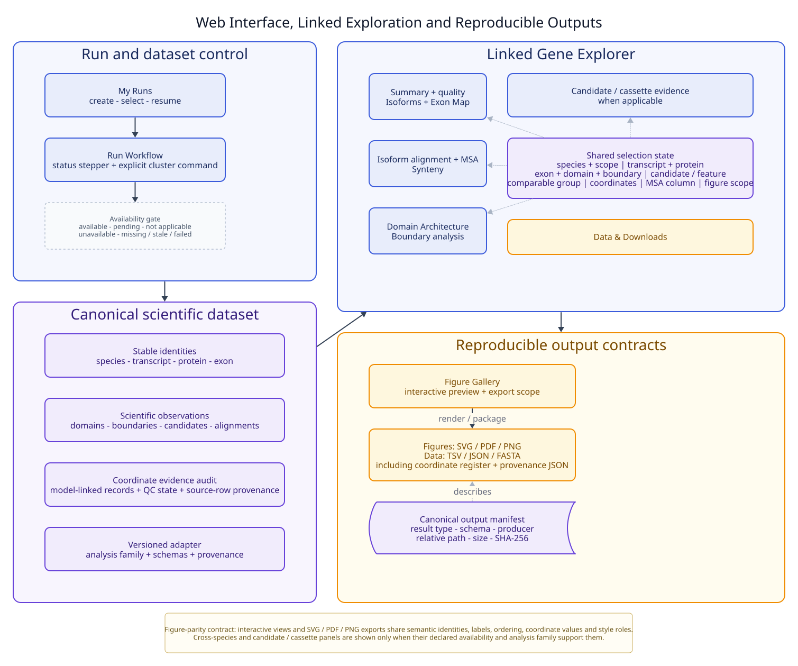

## Detailed architecture and appendix figures

### 02 - Detailed end-to-end analysis pipeline

[Open PDF](pdf/02_analysis_pipeline.pdf) ·
[Open SVG](svg/02_analysis_pipeline.svg) ·
[D2 source](d2/02_analysis_pipeline.d2)


### 03 - Source-code component and dependency map

[Open PDF](pdf/03_component_diagram.pdf) ·
[Open SVG](svg/03_component_diagram.svg) ·
[D2 source](d2/03_component_diagram.d2)


### 05 - Container and deployment view

[Open PDF](pdf/05_c4_container_diagram.pdf) ·
[Open SVG](svg/05_c4_container_diagram.svg) ·
[D2 source](d2/05_c4_container_diagram.d2)

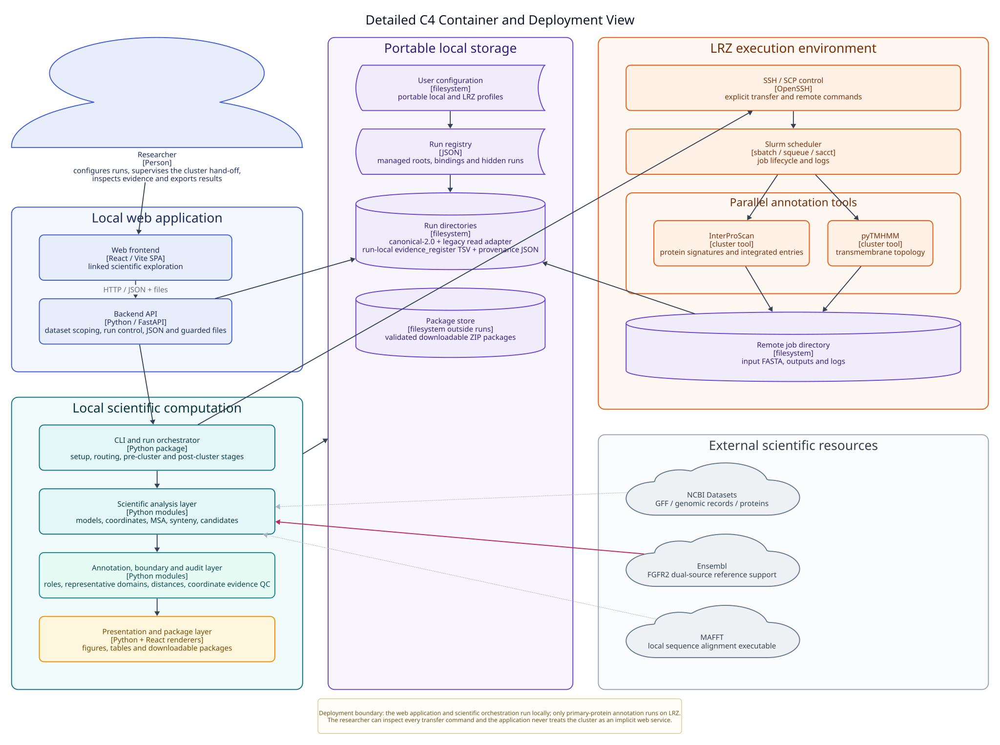

### 08 - Post-InterPro evidence and boundary pipeline

[Open PDF](pdf/08_post_interpro_pipeline.pdf) ·
[Open SVG](svg/08_post_interpro_pipeline.svg) ·
[D2 source](d2/08_post_interpro_pipeline.d2)


### 10 - Run, storage, and state contracts

[Open PDF](pdf/10_run_storage_state_contracts.pdf) ·
[Open SVG](svg/10_run_storage_state_contracts.svg) ·
[D2 source](d2/10_run_storage_state_contracts.d2)

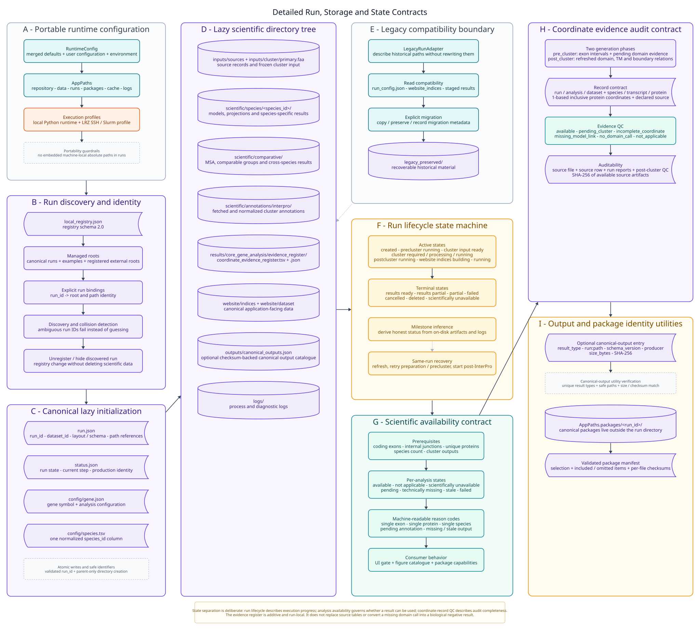

### 11 - Web, API, selection, and export integration

[Open PDF](pdf/11_web_api_selection_exports.pdf) ·
[Open SVG](svg/11_web_api_selection_exports.svg) ·
[D2 source](d2/11_web_api_selection_exports.d2)

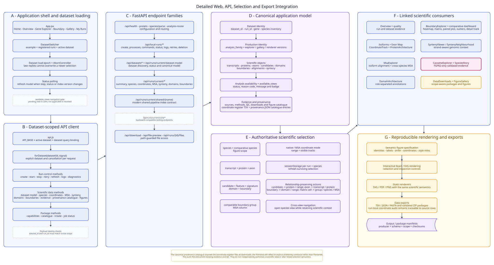

## Architecture poster

### 09 - Architecture overview poster

[Open PDF](pdf/09_exondomaincompare_architecture_poster.pdf) ·
[Open SVG](svg/09_exondomaincompare_architecture_poster.svg) ·
[D2 source](d2/09_exondomaincompare_architecture_poster.d2)

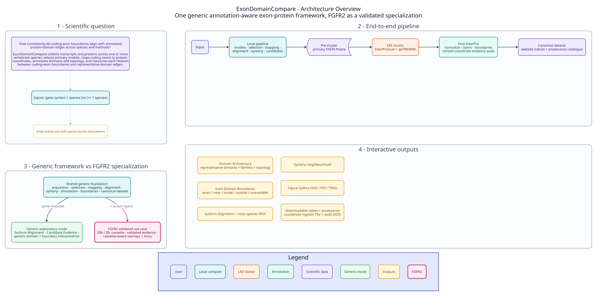

## Rebuilding the diagrams

The diagrams use the shared [`_theme.d2`](d2/_theme.d2) style definition. With
[D2](https://d2lang.com/) and `rsvg-convert` installed, a diagram can be rebuilt
as follows:

```bash
d2 --layout dagre docs/architecture/d2/01_overall_system_architecture.d2 \
  docs/architecture/svg/01_overall_system_architecture.svg

rsvg-convert -f pdf \
  -o docs/architecture/pdf/01_overall_system_architecture.pdf \
  docs/architecture/svg/01_overall_system_architecture.svg
```

See [`TRACEABILITY.md`](TRACEABILITY.md) for the mapping between detailed
diagram elements, implementation modules, and representative tests.
